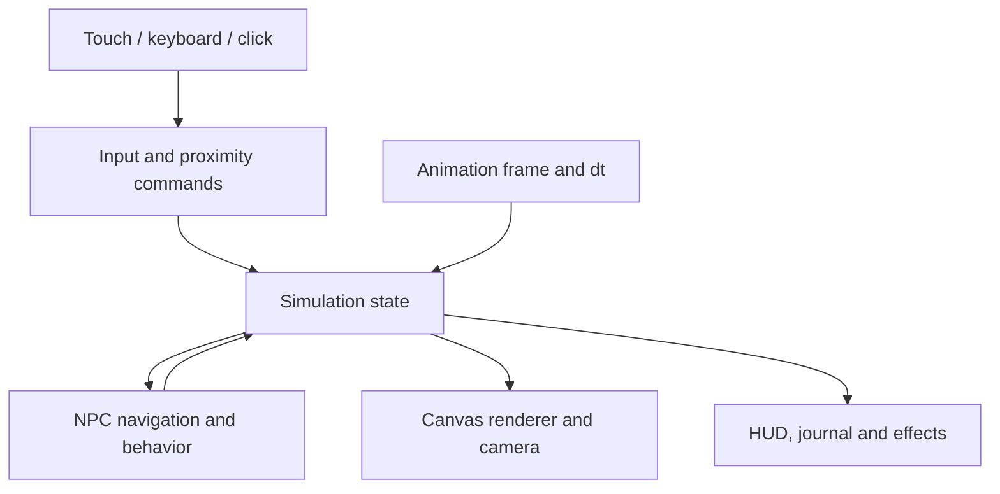
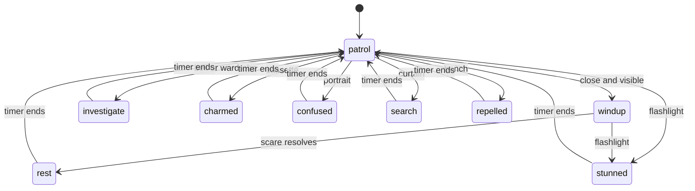

# Ánh Trăng — Gameplay, Game Script & Architecture

Coding handoff · mobile simulator snapshot · 4 October 2026

Use this combined reference alongside the editable files and assets in the starter ZIP.

---

# Gameplay — implemented mobile simulator

## Core loop

Walk around a haunted-house room, interact with nearby objects and react to independently moving characters. There is no four-choice encounter screen. Object use changes the simulation immediately; dialogue is short feedback, not a turn-based command system.

The art direction is Xanh Đêm: blue/teal room, mint lights, detailed pixel characters, sparse props and a compact HUD. The current build contains one vampire dining-room scene. Role selection happens before the simulation begins.

## Controls

| Action | Phone | Keyboard / mouse |
|---|---|---|
| Move | Left joystick, or tap floor | WASD/arrows, or click floor |
| Use nearby object | Contextual hand button; or tap marker and auto-walk | E; or click marker |
| Visitor flashlight | Sun button, toggle; initially aims toward a nearby ghost | Space, toggle; direction follows movement |
| Employee scare | Large Hù button | Space |
| Hide / activate sound prop | Small secondary button | Q |
| Place sound prop, employee | + / Đặt loa | P |
| Run | Hold Chạy while moving the joystick | Hold Shift; desktop toolbar also has a toggle |
| Journal / pause | Header buttons | J / Esc |

The joystick captures its own pointer so another finger can use an action. Releasing/canceling the pointer resets movement. Opening a dialog, switching away from the page or losing window focus clears held input and pauses the run. There is no swipe/dodge mechanic in this build.

In portrait, the camera zooms and follows the player. In short landscape touch layouts, controls sit over the sides of the play area. The camera does not rotate. Phone flashlight aim assistance occurs when switching the light on, not continuously; subsequent movement can change its direction.

## Visitor

Start with fear 20, stamina 100 and battery 100. Walk at 104 world units/second or run at 172. Running drains 14 stamina/second; walking/idle restores 3. The flashlight drains 6 battery/second. The bench restores 22 stamina, 24 battery and removes 16 fear per second while resting. Values are prototype tuning constants, not final balance.

The vampire patrols, pursues within 240 units with line of sight, and begins a 1.25-second scare windup within 115. A successful scare within 135 adds 24 fear. Close exposure can also add fear. A correctly aimed light cone within 245 units interrupts eligible ghost states and makes it retreat for 3.5 seconds. Furniture blocks parts of the line of sight.

At maximum fear, the simulation sends the player to the rest area, resets fear to 40 and preserves clues. The two companions follow the player; relationship effects from the full script are not yet simulated.

## Environmental effects

Each object must be within 64 world units to use directly. Tapping a marker from farther away queues navigation, then use within 48 units. Object feedback appears as rings, a short speech message, and a state label/countdown above the ghost. Combining different prop types increments a feedback combo counter; it does not currently multiply damage or rewards.

| Object | Visitor effect on ghost | Base duration | Cooldown |
|---|---|---:|---:|
| Bell | Investigates the bell location, overriding pursuit | 7 s | 11 s |
| Cassette | Stops to listen; interrupts pursuit | 5 s | 14 s |
| Portrait | Becomes confused and retreats toward a preset point | 5 s | 12 s |
| Wardrobe | Investigates the door-slam sound | 6 s | 10 s |
| Curtain | Player hides; ghost searches at the curtain | 4 s | 6 s |
| Bench | Safe light repels ghost while player rests | 4 s | 8 s |

Repeated activation of the same object reduces its effect duration by 0.65 seconds per prior use, with a minimum duration of 2 seconds. Cooldowns prevent immediate refreshing. Props can override another prop's state; flashlight interruption follows its own allowed-state rules. These are authored effects, not a general physical engine.

A clue is collected the first time the player checks the portrait, ticket or cassette. Later uses can still activate that object's effect. Once the Zin story resolution is active, ordinary prop effects stop so the story can be completed safely.

## Employee

The performer starts with 100 stamina. Place up to three sound props at the player's location (5 stamina each; at least 60 units apart). Visit the right-hand door to admit a group of two guests. Groups continue moving even if the player does nothing.

Guests have position, route, attention/caution, interest, fear, distraction, prior prop exposure and an exit state. They move between observation points, wait briefly, and leave when bored, overwhelmed or after their visit duration. Default interest is 20 seconds, refreshed by a successful scare or distraction; the upper visit duration is 75 seconds.

Activate the nearest placed speaker to attract guests within 300 units, unless they already responded to that specific speaker. It has a 5-second activation cooldown. Visitors investigate for approximately 5 seconds. Fixed room props also distract nearby guests within 360 units and reduce caution; the exact ghost state is not applied to guests.

A scare costs 22 stamina, has a 3-second cooldown, and checks for guests within 145 units with clear line of sight. Guests are easier to surprise when distracted, not facing the performer, or not already cautious. The initial reward is 25 points for surprise, otherwise 10; repeated hits on the same guest drop to 3. The code currently uses a brief frozen reaction rather than a full fleeing animation.

After both guests leave, another group can be admitted. Rest at the bench, inspect clues between groups, or use Dừng show. Ordinary check-out is available only when all guests have left; stopping the show remains available during a group. The prototype does not yet simulate physical escorting, safety inspection or base wages.

## Clues and endings

- Portrait: **name — Zin**.
- Table: **ticket — 000**.
- Cassette: **tape — old welcome**.

With all three clues, Zin appears after at least 20 seconds of a visitor run, or after an employee has completed a group. The normal vampire stops pursuing. Use the table to complete the ticket, or the wardrobe/roster to invite Zin onto the staff.

| Ending | Implemented trigger |
|---|---|
| Mai chơi tiếp | Visitor exits before 20 seconds without clues |
| Rành quá rồi | Visitor exits after 20 seconds or after finding a clue |
| Xé vé | Use table when Zin's resolution is active |
| Ma mới | Use wardrobe when Zin's resolution is active |
| Không bỏ ai lại | Employee stops the show through the safety dialog |
| Hết ca | Employee checks out while no guests remain |

Reward counts and time appear on the end screen. Replay resets all run state. There is no durable save, unlocked-ending collection or server state yet.

## Intended expansion, not yet shipped

Connected park hub and four attraction rooms; real directional walk/run/scare animation; inventory items other than the flashlight; different ghost sensory rules; persistent friendships; day activities; costume abilities; skill progression; wages and prop purchases; richer guest routes and group behavior; NPC-specific dialogue. Preserve the same action-first principle when implementing these features.

---

# CA ĐÊM Ở CÔNG VIÊN ÁNH TRĂNG
## Kịch bản và thiết kế gameplay v2 — RPG / mô phỏng nhà ma

Ý tưởng gốc: con của Duy Doan. Nhân vật và lời thoại sử dụng bản tiếng Việt đã được chỉnh sửa: Mr. D, Na, Bơ, Xác Sống, Ma Cổ Dài, Quái Nhân và Khách Số 0.

## 1. Định nghĩa lại trò chơi

Người chơi điều khiển một nhân vật trong không gian liên tục. Đi đâu, đứng chỗ nào, cầm thứ gì, dùng lúc nào, giúp ai và bỏ lỡ điều gì đều tạo hậu quả. Phòng nhà ma vẫn hoạt động khi người chơi chưa làm gì: khách bước vào, nhân viên phục kích, đạo cụ chuyển động, đồng nghiệp mệt, hàng đợi dài ra.

Không dừng mỗi lần gặp ma để chọn một trong bốn câu trả lời. Những ý tưởng như rọi đèn, trốn, đánh lạc hướng hoặc bắt chuyện trở thành **hành động trong thế giới**. Đi tới chuông rồi bấm chuông; chạy tới rèm rồi nấp; nhắm đèn vào người đang tiến lại; dừng bên một người để nói chuyện. Hội thoại ngắn hiện cạnh nhân vật và không thay thế vận động.

Hai vai có cùng bản đồ, cùng đạo cụ, cùng giờ mở cửa, nhưng mục tiêu khác nhau:

- **Khách:** trải nghiệm nhà ma, vượt qua các khu, giữ bình tĩnh, tìm hiểu bí mật, vui chơi với bạn bè.
- **Nhân viên:** vận hành một ca diễn, chuẩn bị sân khấu, đọc phản ứng khách, sử dụng thể lực hợp lý và làm việc với đồng nghiệp.

RPG nằm ở nhân vật, nhiệm vụ, kỹ năng, đồ dùng, quan hệ và tiến trình qua nhiều đêm. Simulation nằm ở cách các hệ thống hoạt động đồng thời và phản ứng với hành động thực tế. Nhánh truyện được tạo bởi điều người chơi đã làm; bảng chọn chỉ dùng cho những việc tự nhiên cần giao diện như chọn vai, xem đồ, cài đặt hoặc mua vật phẩm.

## 2. Góc nhìn và điều khiển

Giữ pixel art Xanh Đêm: nền xanh chàm, tường xanh rêu, đèn bạc hà; nhân vật chi tiết hơn, không quá đầu to. Mặt sàn đủ trống để nhận biết đường đi. Camera từ trên xuống hơi nghiêng. Hình nhân vật, đồ vật và vùng va chạm là các phần riêng biệt, không phải ảnh chụp giao diện gắn nút lên trên.

| Hành động | Máy tính | Cảm ứng / chuột |
|---|---|---|
| Di chuyển | WASD / phím mũi tên | Chạm điểm đến; nhân vật tìm đường |
| Chạy | Giữ Shift | Bật nút Chạy |
| Tương tác | E khi ở gần | Chạm vật thể; nhân vật đi lại rồi tương tác |
| Dùng hành động chính | Space | Nút hành động chính |
| Hành động phụ | Q | Nút hành động phụ |
| Dàn đạo cụ, vai nhân viên | P | Nút Đặt đạo cụ |
| Nhật ký | J | Nút Nhật ký |
| Tạm dừng | Esc | Nút Tạm dừng |

Tương tác có điều kiện khoảng cách; không thể nhặt vé ở đầu phòng khi vẫn đứng ngoài cửa. Bàn, tường và vật cản chặn đường đi và tầm nhìn khi thích hợp. NPC và người chơi dùng cùng quy tắc di chuyển cơ bản. Tạm dừng phải dừng đồng hồ, chuyển động NPC và hồi chiêu.

## 3. Vòng chơi của khách

### Nhiệm vụ mẫu: Qua phòng Bàn Tiệc

Bạn vào cùng Na và Bơ. Ma Cà Rồng đứng sau bàn; đường sang khu tiếp theo nằm bên phải. Ban đầu bạn chưa biết cơ chế căn phòng.

1. Tự đi vào, quan sát và thử đồ vật.
2. Nhận tín hiệu báo trước: ma quay đầu, đèn rung nhẹ, tiếng bước chân đổi nhịp.
3. Thực hiện một phản ứng: lùi ra ngoài tầm dọa, chui sau rèm, chiếu đèn, tạo tiếng động hoặc đi tiếp nếu đủ bình tĩnh.
4. Đến được cửa kế tiếp sẽ qua phòng. Điều tra manh mối là mục tiêu phụ, không phải một câu hỏi trắc nghiệm bắt buộc.

### Sợ hãi, sức bền và ánh sáng

Sợ hãi tăng khi ma áp sát hoặc hù trúng; giảm khi nghỉ ở khu sáng đèn. Sức bền giảm khi chạy và hồi khi đi chậm hoặc đứng nghỉ. Đèn pin dùng pin và có hướng chiếu, không tự đánh trúng mọi ma trong phòng. Chiếu đèn đúng hướng làm diễn viên lùi lại hoặc trì hoãn màn hù; giữ mãi sẽ hết pin.

Khi sợ hãi đầy, diễn viên ngừng đuổi và nhân viên đưa bạn về điểm nghỉ. Không mất sạch đồ, không chết, không cần bắt đầu lại toàn bộ. Nghỉ xong có thể quay vào. Mức sợ hãi không phải thước đo phẩm chất hay lòng can đảm.

### Bạn đồng hành

Na đi gần người chơi, phản ứng mạnh khi bị bỏ quá xa. Bơ dừng xem các thiết bị và đôi khi đoán sai. Ở bản đầy đủ, đứng đợi, gọi bạn quay lại, soi đèn giúp hoặc chia đồ sẽ thay đổi quan hệ. Một dòng thoại không tự tạo quan hệ tốt; hành động phải thể hiện điều đó.

**Ví dụ:** Na bị kẹt sau bàn. Người chơi chạy thẳng ra cửa thì qua phòng nhanh hơn nhưng Na mất tin tưởng. Quay lại chiếu đèn để Na đi cùng thì mất thời gian và pin, nhưng cả nhóm ra cùng nhau. Không cần một hộp thoại “giúp / không giúp”.

## 4. Vòng chơi của nhân viên

### Ca diễn gồm ba giai đoạn

**Chuẩn bị.** Người chơi đi đến tủ đồ thay trang phục, lấy đạo cụ, đặt loa hoặc hình nộm ở vị trí hợp lệ, thử đường ra và chọn điểm phục kích. Thời gian chuẩn bị tiêu chuẩn là 45 giây; chế độ thử nghiệm cho phép mở cửa khi sẵn sàng.

**Đón khách và biểu diễn.** Nhóm khách đi vào theo tuyến. Họ không đứng im đợi bạn chọn lệnh: người nhìn tranh, người đi trước, người quay lại gọi bạn. Người chơi phải di chuyển đến vị trí phù hợp, gây tiếng động và tung chiêu khi khách đang hướng sự chú ý nơi khác.

**Thu dọn và nghỉ.** Khách nhận xét khi rời phòng. Người chơi hồi sức, đổi bố trí nếu một chiêu đã bị đoán ra, rồi đón nhóm kế tiếp. Hết ca mới quyết toán lương và nhiệm vụ.

### Hành động thật trong không gian

| Hành động | Điều kiện | Chi phí / tác dụng |
|---|---|---|
| Rình rập | Đi chậm, tránh hướng nhìn của khách | Ít hao thể lực; tạo lợi thế bất ngờ |
| Tung chiêu | Khách trong tầm, không có vật cản | Tốn thể lực; hiệu quả tùy khoảng cách và mức cảnh giác |
| Rượt ngắn | Khách còn trong khu diễn, lối đi thông | Tốn nhiều thể lực; không đuổi ra khu nghỉ |
| Đặt đạo cụ | Ô đặt trống, không chặn lối ra | Tốn một ít thể lực và một lượt đạo cụ |
| Kích hoạt tiếng động | Có đạo cụ trong tầm điều khiển | Kéo sự chú ý khách về vị trí đạo cụ |
| Nghỉ | Đi tới ghế hậu trường | Hồi thể lực; khách vẫn có thể mất kiên nhẫn |
| Dừng show | Người chơi chủ động bấm công tắc | Bật đèn, ngừng ma, dẫn khách ra; giữ phần thưởng đã có |

### Khách là các tác nhân mô phỏng

Mỗi khách có vị trí, điểm đến, hướng nhìn, mức cảnh giác, hứng thú, sợ hãi và kiên nhẫn. Trạng thái thông thường: đi vào → quan sát → bị phân tâm / bị hù → phản ứng → tiếp tục hoặc rời phòng.

- Thấy diễn viên đi thẳng đến sẽ tăng cảnh giác.
- Nghe tiếng động sẽ nhìn hoặc đi về phía phát ra âm thanh.
- Gặp chiêu giống nhau liên tiếp sẽ quen; không thể đứng một chỗ bấm hù mãi để kiếm điểm.
- Không có diễn biến mới quá lâu sẽ chán và đi tiếp.
- Quá sợ sẽ cần được dẫn ra; không thưởng cho việc tiếp tục nhắm vào người đang quá tải.

Chất lượng ca diễn dựa trên đúng nhịp, sự mới lạ, sự hài lòng và cách chăm sóc khách. “La lớn nhất” không đồng nghĩa “diễn tốt nhất”. Các công thức điểm là thông số thử nghiệm, phải cân bằng bằng chơi thử.

## 5. Kịch bản Đêm 1 — Một người vẫn đang đợi

### Cảnh 1: Trước giờ mở cửa

Mưa vừa tạnh. Máy xèng nuốt đồng xu của một cậu bé. Sau cửa nhân viên, Xác Sống lục tung túi đồ.

**Xác Sống:** “Đứa nào nẫng bộ răng của tui rồi?”

**Ma Cổ Dài:** “Ngâm trong cốc trà đá kìa ba.”

Người chơi có thể di chuyển trong lúc họ nói. Đi qua sẽ nghe tiếp; bỏ đi thì không bị giữ chân bởi cutscene.

Chuông quầy vé reo. Mr. D nhìn xuống thấy vé 000. Ô cuối chưa đóng mộc.

**Mr. D:** “Lại giở trò nữa à?”

**Khách:** nhận vé từ quầy và tìm Na, Bơ trước cửa nhà ma.  
**Nhân viên:** nhận bộ đàm, đến tủ đồ và chuẩn bị vị trí được phân công.

### Cảnh 2: Phòng Nghĩa Địa — học cách quan sát

Xác Sống lần theo tiếng động. Ván sàn có một đoạn kêu cót két; một đồng xu rơi sẽ khiến hắn quay đầu. Người chơi có thể tự bước thử để học quy tắc trước khi bị đuổi.

**Khách:** nhặt đồng xu rồi ném theo hướng chỉ định, đi vòng qua vật cản hoặc giúp tìm đồ thất lạc. Nếu đang bật đèn khi trốn sau áo khoác, vệt sáng sẽ lộ vị trí.

**Nhân viên:** bố trí một nguồn tiếng động và chọn điểm xuất hiện khác. Nếu bung tủ quá sớm, khách còn ở ngoài cửa. Nếu tủ bị kẹt, có thể gõ nhờ đồng nghiệp; khách Bơ đi gần cũng có thể mở giúp.

**Bơ, khi mở tủ:** “Anh cần giúp không?”

**Na, sau khi bị hù trúng:** “Tui đang khởi động gân cốt thôi.”

Hoàn thành khi khách đi qua cửa kế tiếp hoặc nhóm khách đã rời khu diễn. Không đợi người chơi bấm nút chuyển cảnh.

### Cảnh 3: Bàn Tiệc — phòng thử nghiệm chính

Ma Cà Rồng quay về phía ai đang gây tiếng động. Một hồi chuông kéo hắn khỏi vị trí. Bàn ăn tạo đường vòng; rèm là chỗ nấp; ghế nghỉ nằm ngoài vùng diễn.

**Ma Cà Rồng:** “Nhà có khách. Mời ngồi.”

Khách có thể đi thẳng tìm đường ra, dùng đèn để ngăn một pha áp sát, nấp chờ hắn quay đi, hoặc kiểm tra căn phòng. Nhân viên có thể đặt tiếng động bên trái rồi xuất hiện bên phải. Cùng một đạo cụ có ý nghĩa khác nhau với hai vai.

Ba manh mối nằm ở những điểm cụ thể, phải tự đến gần:

1. Tấm vé ở bàn: bốn dấu mộc và một ô trắng.
2. Máy cát sét: lời chào cũ “Chào mừng Zin đến với Nhà Ma.”
3. Bảng tên trên ghế: ZIN.

Khi có đủ manh mối và một nhóm đã hoàn thành lượt chơi, chiếc ghế thứ năm tự xê dịch. Diễn viên dừng động tác đang làm.

**Giọng lạ:** “Phần của mình đâu?”

Người chơi vẫn điều khiển được nhân vật. Âm thanh là tín hiệu điều tra; không bật hộp thoại yêu cầu chọn một đáp án.

### Cảnh 4: Giờ nghỉ

Ra sân hủ tiếu. Đứng bên bàn Ma Cổ Dài và tương tác để cầm giữ trang phục trong lúc cô khâu. Đưa đồ ăn cho Xác Sống. Ngồi cạnh Na đủ lâu để nghe câu chuyện của cô. Những hoạt động ngắn này có thời gian và animation; không biến thành bốn nút cộng chỉ số.

**Na:** “Mình không sợ ma. Mình chỉ không thích quay lại mà chẳng thấy ai.”

Giữ lời bằng cách đi cùng Na ở phòng kế tiếp. Hứa rồi chạy mất thì hệ thống ghi nhận hành động thực tế.

### Cảnh 5: Hành lang Ma Cổ Dài

Một bóng dài trượt trên trần. Nhìn xuống có lan can dẫn đường; nhìn lên thấy dây kéo và bóng thứ hai.

**Khách:** cúi người đi dưới vùng bóng, rọi vào cơ cấu để làm gián đoạn màn hù, hoặc đi vào cửa hậu. Mỗi đường có thời gian và rủi ro khác nhau.

**Nhân viên:** điều khiển vị trí bóng và hướng đèn, tránh tiêu hết thể lực khi chưa có khách nhìn lên. Nhờ đồng nghiệp tiếp sức nếu cần.

Ra cuối phòng, Ma Cổ Dài đã tháo mặt nạ mà trong gương vẫn có một cái cổ khác.

**Ma Cổ Dài:** “Cái đó… đâu phải của tui.”

### Cảnh 6: Phòng cuối

Khách Số 0 đứng trước máy đóng mộc. Người chơi có thể tiến đến nói chuyện, đặt băng vào máy, đem vé tới bàn đóng mộc, mở cửa ra ngoài hoặc dẫn Zin về phía hậu trường.

**Zin:** “Còn một phòng nữa mà…”

Không có màn hình “chọn kết thúc”. Kết thúc được xác định bởi hành động hoàn tất:

| Kết cục | Hành động trong thế giới |
|---|---|
| Mai chơi tiếp | Khách dùng cửa ra khi chưa hoàn thành chuyến chơi |
| Hết ca | Nhân viên chấm công sau một ca bình thường |
| Rành quá rồi | Khách vượt qua khu cuối, không giải quyết chuyện vé 000 |
| Không bỏ ai lại | Bật đèn, tập hợp nhóm và đưa mọi người ra |
| Xé vé | Mang đủ bằng chứng, bật lời chào, đóng mộc cuối cho Zin |
| Ma mới | Dẫn Zin tới bảng phân ca, đăng ký một vị trí cho Zin |

**Zin, khi được đóng mộc:** “Lâu quá…”

Hôm sau, góc vé có thêm hình chiếc ô. Nếu Zin gia nhập, bảng phân ca xuất hiện dòng chữ của Mr. D: “Đứa này khỏi cần phát đồng phục.” Không tự hủy kết thúc đã chọn để kể lại cùng một truyện ở đêm sau.

## 6. Nhiệm vụ, tiến trình và quan hệ trong bản đầy đủ

Nhiệm vụ có điều kiện hoàn tất quan sát được: hộ tống một bạn ra, hù thành công ba khách bằng hai kiểu khác nhau, sửa cánh cửa trước giờ mở cửa, tìm đồ thất lạc. Không cần NPC giao mọi thứ bằng một đoạn thoại dài.

Kỹ năng khách: bình tĩnh, quan sát, phối hợp. Kỹ năng nhân viên: diễn xuất, dàn cảnh, sức bền. Tiến trình mở cách chơi mới: thêm chỗ đặt đạo cụ, một cách xử lý trang phục, khả năng nhận biết hướng chú ý của khách. Tránh chỉ cộng số rồi khiến nội dung cũ trở nên vô nghĩa.

Tiền từ ca diễn mua trang phục, sửa đạo cụ, trang trí phòng nghỉ. Huy hiệu khách đổi vật lưu niệm và vé tuyến mới. Đồ vật không tự tăng quan hệ nếu người nhận không cần chúng. Lương cơ bản giữ nguyên khi phải dừng show vì khách cần nghỉ.

## 7. Phạm vi bản playable v2

**Có trong bản thử một phòng:** di chuyển WASD/phím mũi tên hoặc chạm để tìm đường; va chạm với bàn; tương tác theo khoảng cách; nhân vật và NPC tách khỏi nền; đèn pin; nấp và nghỉ; ma tuần tra/áp sát; đặt và kích hoạt đạo cụ; khách tự đi, bị phân tâm, phản ứng và rời phòng; thể lực, pin, sợ hãi; manh mối trong thế giới; hoàn tất phòng và kết thúc qua các điểm tương tác; nhật ký và tạm dừng.

**Chưa phải tính năng hoàn chỉnh của bản thử:** cả công viên, bốn phòng liên thông, lịch làm việc nhiều ngày, AI hội thoại tự do, hệ thống kỹ năng lâu dài, kinh tế cửa hàng, quan hệ sâu, nhiều bộ animation theo tám hướng, hoặc multiplayer. Đó là phạm vi của bản phát triển tiếp theo, không được mô tả như đã có trong bản một phòng.

### Tiêu chí đánh giá bản thử

- Có thể hiểu cách chơi bằng cách di chuyển và thử hành động, không cần đọc kịch bản trước.
- Vị trí thay đổi kết quả: chiếu đèn sai hướng hoặc hù quá xa không có tác dụng.
- Khách tiếp tục hoạt động khi người chơi đứng yên.
- Đạo cụ tác động đến sự chú ý; lặp một chiêu có hiệu quả giảm.
- Hồi sức có ích nhưng cũng tạo cơ hội khách đi mất.
- Đồ vật ở xa không thể kích hoạt ngay lập tức.
- Người chơi không bị kẹt nếu bỏ qua manh mối.
- HUD không che không gian chơi; thông báo ngắn không khóa điều khiển.

## 8. Một phút gameplay minh họa

**00:00–00:10.** Nhân viên bước tới tủ thay áo choàng. Đi vòng bàn, đặt loa phía bức tranh rồi lui vào chỗ phục kích.

**00:10–00:20.** Mở cửa. Na đi trước, Bơ dừng nhìn cánh cửa bí mật. Người chơi chưa hù; chờ họ qua khỏi bàn.

**00:20–00:30.** Kích hoạt loa. Cả hai quay trái. Người chơi chạy ngắn sang phải và xuất hiện. Na giật mình, Bơ nhìn thấy quá muộn. Một pha hù thành công.

**00:30–00:40.** Nhân viên bấm hù lần nữa ngay lập tức nhưng chiêu đang hồi. Na đã đề phòng. Người chơi phải đổi vị trí thay vì bấm tiếp.

**00:40–00:50.** Người chơi đi tới ghế nghỉ. Khách vẫn đang đi; nếu nghỉ quá lâu họ sẽ rời phòng. Chọn đứng dậy sớm để thử một màn thì thầm.

**00:50–01:00.** Nhóm đi ra, phản ứng được tính vào chất lượng ca. Trong lúc thu dọn, chuông tự reo dù không có ai ở cạnh. Nhiệm vụ mới xuất hiện: “Kiểm tra chiếc vé trên bàn.”

Đây là nhịp RPG/simulation cần hướng tới: **hành động tạo tình huống, tình huống tạo câu chuyện**.

---

# Architecture — current implementation and coding guide

## Stack and entry points

Plain HTML5 Canvas 2D, CSS and modern JavaScript ES modules. No framework, package manager, bundler, server application or database is required. This is deliberately a small prototype that can be ported into an engine later.

- `src/index.html`: layout, game canvas, HUD, role overlay, touch controls, dialogs.
- `src/style.css`: responsive HUD and touch layout; portrait/landscape media rules; safe-area padding.
- `src/sim.mjs`: authoritative run state, navigation, interactions, effects, resource updates, NPC AI and ending conditions. No browser dependencies.
- `src/app.js`: input, coordinate conversion, frame loop, Canvas rendering, camera, DOM feedback, dialogs and optional browser model-context tool registration.
- `tools/build-standalone.py`: embeds CSS, modules and PNGs into `simulator.html` for direct local playback.

The modular source is the editable source of truth. Treat the standalone HTML as generated output. Do not make independent edits to both copies.

## Runtime flow

The app loads both PNGs, then enables role selection. `new Simulation(role)` creates a fresh run. `requestAnimationFrame` supplies elapsed time, clamped to 0.06 seconds per step to avoid enormous updates after a stalled frame. The UI refreshes roughly every 0.08 seconds. Dialogs pause simulation advancement but the rendering loop remains active.

This uses variable timestep integration. For more complex physics/replays, introduce a fixed-step accumulator before adding new movement systems; do not assume current updates are bit-identical across devices.

## World and collision

World coordinates are **1000 × 562**, independent of the screen's pixel dimensions. Actor positions refer to their feet. The walkable region is bounded with three static collision rectangles: table, bench and wardrobe. The background is decorative; it does not automatically define collisions.

`passable(x,y,r=11)` checks boundaries and expanded rectangles. `moveActor` resolves X and Y separately, allowing wall sliding. NPCs are not solid colliders with one another; actor overlap can occur.

`findPath` constructs a 20-unit grid over the walkable floor, snaps start/target to a nearest traversable node, then performs breadth-first search with four neighbors. This is BFS, **not A***. Static pathfinding works at the current room scale; it rebuilds its grid per request. A larger map should precompute the grid, cache adjacency and reduce path recalculation. The movement path is kept on each actor as `path`.

`visible(a,b)` samples the segment approximately every 12 units against obstacle rectangles. It is a simple prototype line-of-sight test, not exact polygon ray casting.

## Coordinate systems and camera

1. CSS viewport dimensions come from `canvas.getBoundingClientRect()`.
2. Canvas backing dimensions use device-pixel ratio capped at 2.
3. The renderer calculates world-to-screen scale and camera offset.
4. Input applies the inverse transform: world position = screen-relative position / scale + camera offset.
5. Portrait touch layouts use a closer camera that follows/clamps around the player. Landscape usually exposes more of the room.

If adding zoom, rotation or camera easing, update both rendering and `point(event)` together. Test interaction markers at all four screen edges. Do not convert pointer coordinates using the original fixed canvas width after applying a camera transform.

## State ownership

`Simulation` owns the role, player, fear/stamina/battery, hiding/resting/torch flags, cooldowns, object-use counts, clues, journal, sound props, ghost state, companions, guest groups, score, run time, story state and ending.

Important public operations:

| Operation | Responsibility |
|---|---|
| `navigate(x,y,spotId)` | Find a path; optionally queue proximity interaction |
| `interact(id)` | Verify range, operate a fixture, collect clue or complete an ending |
| `action()` | Visitor flashlight toggle or employee scare |
| `secondary()` | Hide near curtain or trigger nearest sound prop |
| `place()` | Place employee sound prop with limits and costs |
| `effect(id,spot)` | Apply fixture cooldown, visuals and behavior changes |
| `step(dt,input)` | Advance movement, resources, timers and role-specific NPC systems |
| `tryMystery()` | Gate the Zin story resolution |
| `finish(key)` | End the run and stop its simulation advancement |

The controller should call these operations instead of editing fear, clues or NPC state from button handlers. The current mobile flashlight handler also sets initial facing toward a nearby ghost; consider moving that aim-assist rule into the model when input complexity grows.

## Ghost state machine

The diagram is illustrative: environmental effects can interrupt eligible active states, not only patrol. All three clues plus the role completion gate activate a story state that stops the ordinary ghost AI. The engine contains explicit effect precedence rather than a reusable status-effect stack. Refactor to a data-driven effect system before adding many interacting ghost species.

## Touch input

The joystick tracks a specific `pointerId`, uses pointer capture, applies a dead zone, and emits normalized X/Y movement. Pointer-up, pointer-cancel and lost capture reset it. Action buttons can receive a second pointer while the joystick remains held. Run uses its own hold interaction. Page hiding, blur and dialogs clear held input to prevent stuck movement.

Touch UI is selected with coarse-pointer and width media conditions. Avoid using screen width alone to determine all input behavior: tablets can have a keyboard and mouse. Desktop controls remain available.

Keyboard movement is normalized; diagonal input is not faster. The current simulation normalizes joystick magnitude too, so the joystick supplies direction, not full analog walking-speed control. Running remains a separate action.

## Rendering and assets

`assets/world.png` is the empty room. `assets/actors.png` is an RGBA atlas with four isolated front-facing sprites. Crop metadata is in `actors.atlas.json`; `app.js` currently duplicates those rectangles in `crops`. Update both together, or refactor the renderer to load the JSON.

Each sprite is drawn with a bottom-center anchor, fixed display height, optional horizontal mirroring and a small movement bob. Depth sorting uses actor foot Y. The table is painted into the backdrop, so there is no general foreground occlusion/tile-layer pipeline. When adding rooms, separate background, colliders, foreground occluders, actors and effects.

Zin currently reuses the player sprite with transparency. Labels, rings, cones and timing bars are runtime feedback geometry. Sound props use a small labeled marker rather than a finished prop sprite. Those placeholders should be replaced during art production.

The supplied character atlas is a reusable image source, not a complete animation library. The key-screen images under `references/` are concept references, not runtime textures or browser screenshots. The latest approved hybrid style is reference 01; older choices-based layouts should not be reintroduced as the primary gameplay.

## Offline HTML

The export inlines the simulation followed by the app code in one module script, removes module import/export syntax at that boundary, embeds the room and atlas as PNG data URLs, and embeds CSS. It uses system fonts. No local `fetch`, external module imports or remote image requests are required.

If you add new files, fonts, sounds or modules, extend the export tool explicitly. The current exporter is intentionally tied to this simple file structure; it is not a general JavaScript bundler. Larger projects should use a real build system with an intentional offline asset strategy.

## Current limitations and next steps

1. Add real walk/idle/scare/hurt animations and directional sprites, including Zin and Mr. D.
2. Split room data, interactables, effects and ghost species into data files rather than long conditional methods.
3. Cache pathfinding nodes; add NPC separation and authored entrance/exit transitions.
4. Add persistent progress with versioned save data. There is no localStorage/cloud save now.
5. Implement objectives and relationship effects as systems. Current companions only follow.
6. Add semantic nonvisual descriptions and alternate interaction access. The Canvas scene is not fully screen-reader navigable.
7. Test on physical iOS Safari and Android Chrome: safe areas, multitouch cancellation, rotation, backgrounding, audio if added, and low-power performance.
8. Add actual sound/animation for effects, with mute and reduced-motion settings. Current effects are primarily visual/behavioral.

No multiplayer, authentication, economy, backend, external APIs or production analytics are present. Optional `document.modelContext` tools are feature-detected and safely skipped when unsupported; they are not needed to play. Their registration was not validated in a supported browser context.
